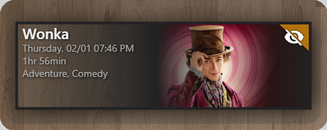

**Requires a custom-component:** 
This card will only work if you've installed a custom-component to feed it. A list of the current custom components can be found in the [Github readme](https://github.com/custom-cards/upcoming-media-card).

## Features
* Poster and Fan Art views
* All text can have its contents, color, and size customized.
* Most design elements can be hidden or have their color changed.
* 12 or 24 hour display for times and month/day or day/month for dates.
* Indicator flag with customizable mdi icon and color.
* Can limit the number of episodes/movies shown.
* Uses responsive design to scale elegantly
 
#### Fully Interactive Cards&nbsp;&nbsp;-&nbsp;&nbsp;&nbsp;***New!*** ⭐

- Single-click or touch navigation directly to TV Episodes or Movies on Plex, Radarr, and Sonarr Web interfaces.  This feature leverages the new `deep_link` attribute from *[Plex Recently Added](https://github.com/custom-components/sensor.plex_recently_added)*, *[Radarr Upcoming Media](https://github.com/custom-components/sensor.radarr_upcoming_media)*, and *[Sonarr Upcoming Media](https://github.com/custom-components/sensor.sonarr_upcoming_media)*, Integrations. 

  ◉&nbsp;**Video Demo: https://youtu.be/iHo90Wd9oTs**

- New `url:` card setting, for example, `url: https://sonarr.mkanet.dynip.com/calendar` to make the entire card clickable with a single URL. Note, this feature takes precidence over deep_link clickable TV episodes and movies.

#### Transparency Effect&nbsp;&nbsp;-&nbsp;&nbsp;&nbsp;***New!*** ⭐
  - Activate with `enable_transparency: true` for a transparent gradient effect instead of the default opaque gradient background.

    
 

## Supporting Development
- :coffee: [Buy me a coffee](https://www.buymeacoffee.com/FgwNR2l)
- :red_circle: [Tip some Crypto](https://github.com/sponsors/maykar)
- :heart: [Sponsor me on GitHub](https://github.com/sponsors/maykar)
  

| Poster View | Fan Art View
| ---- | ---- 
|  |  

  
 
### If you're having issues, check out the [troubleshooting guide](https://github.com/custom-cards/upcoming-media-card/blob/master/troubleshooting.md) and [@thomasloven's lovelace guide](https://github.com/thomasloven/hass-config/wiki/Lovelace-Plugins) before posting an issue to Github or asking for help on the forums.
